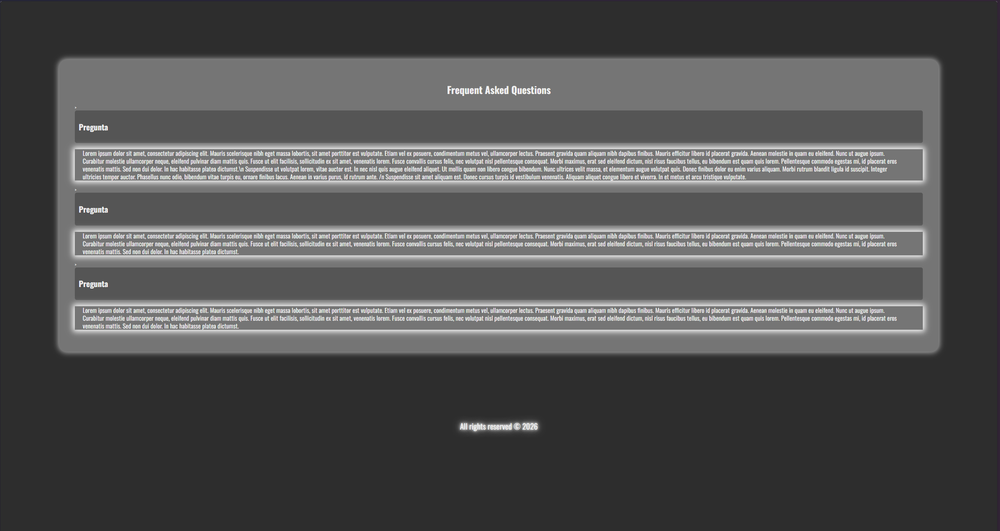

# FAQs-card
A simple and responsive FAQ card built with HTML and CSS. This project features a clean design and interactive sections to display frequently asked questions in a user-friendly format.
Editado y mejorado visualmente por GemeWolf! :)
## Design

## Contributions

Contributions are welcome! If you have ideas or improvements, please open an issue or submit a pull request.

## License

This project is licensed under the [MIT License](LICENSE).